# Haar-Transformation 2D
Usando a Transformada 2D de Haar para comprimir imagens PGM P2

<div style="display: flex; justify-content: center; gap: 3%;">
    
    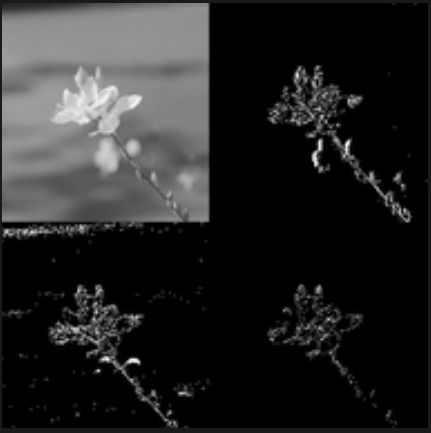
</div>

## 🌍 Leia em outro idioma
- 🇬🇧 [English](README.md)

## 📄 Licença
Este projeto está licenciado sob a [MIT License](LICENSE).

## 📖 O que você verá aqui?
Este projeto desenvolvido durante a cadeira de Sistemas Embarcados foi dividido em 2 partes:
1. Projetar o algoritmo de forma correta, indicando entrada/saída de dados, complexidades e construir e definir os testes para que tudo seja executado em um PC.
2. Transportar o algoritmo para um sistema embarcado fazendo as devidas alterações e gestão de memória.
3. Propor e implementar otimização em uma aplicação embarcada visando a reduzir tempo de computação ou memória. 

## Parte 1: Algoritmo no Ambiente PC
### 🎯 Objetivo
Desenvolver o algoritmo para aplicar a Transformada 2D de Haar em imagens no formato PGM P2. O foco está na correta definição das entradas e saídas de dados, análise de complexidade computacional e criação de testes automatizados para garantir a correta funcionalidade.

### 🛠 Tecnologias Utilizadas
- Linguagem de programação: C, Python
- Ferramentas de teste: Transformada de Haar usando a biblioteca Pywavelets

### 🌐 Ambiente de Desenvolvimento
- Sistema Operacional: PopOS 22.04 LTS e Windows 10
- IDE/Editor: VSCode
- Compilador/Interprete: GCC e Python 3.8+

### 🚧 Desenvolvimento
1. **Entrada de Dados:**
   - Imagens quadradas no formato PGM P2 com proporção 90x90.
2. **Saída de Dados:**
   - Imagem comprimida para proporção 45x45 utilizando a Transformada 2D de Haar.
3. **Implementação do algoritmo base:**
   - O algoritmo implementado pode ser visualizado no arquivo [**haar_transformation_2d.c**](https://github.com/Joaosa100/Haar-Transformation/blob/main/work1/haar_transformation_2d.c).
   - Foram utilizadas as bibliotecas <stdio.h>, <stdlib.h>, <string.h> e <math.h>.
4. **Complexidades:**
   - **Pior caso**: O(NxM), sendo N o número de linhas e M o número de colunas.
   - **Melhor caso**: O(NxM), sendo N o número de linhas e M o número de colunas, requer percorrer todos os elementos da imagem.
5. **Primeiros Testes unitários para validar as transformações:**
   - Nos testes realizados tivemos os seguintes resultados comparando as saídas dos algoritmos [**haar_transformation_2d.c**](https://github.com/Joaosa100/Haar-Transformation/blob/main/work1/haar_transformation_2d.c) com o [**haar_wavelet.py**](https://github.com/Joaosa100/Haar-Transformation/blob/main/tests/haarWavelet.py) usando o [**validacao.py**](https://github.com/Joaosa100/Haar-Transformation/blob/main/tests/validacao.py):
   <br>

   | **Imagem Original** | **Resultado C** | **Resultado Python** |
   |----------------------|------------------|----------------------|
   |  <br> `Animal_Source.pgm` |  <br> `Haar_C_result.pgm` | 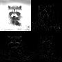 <br> `Haar_Pywavelet_Result.pgm` |

   - Usando o algoritmo para comparar cada pixel dos resultados:
     <br>
      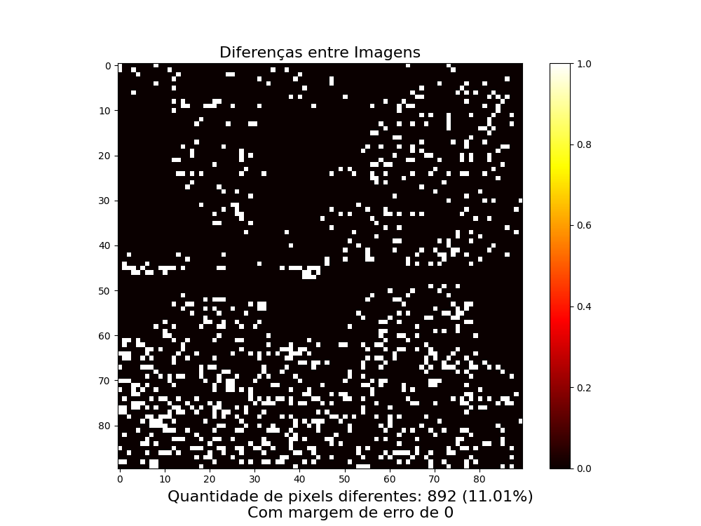

       *Diferenças entre os resultados obtidos no algoritmo implementado em C e Python (Pywavelets). Cada ponto branco representa a divergência identificada na transformação de Haar. Houve uma diferença em 892 pixels no total de 8100 (90x90), totalizando 11.01% de erro utilizando uma tolerância de diferença zero.*

   - Agora, descartando as outras regiões da imagem e utilizando o resultado comprimido (45x45):
   
   | **Imagem Original** | **Resultado C** | **Resultado Python** |
   |----------------------|------------------|----------------------|
   |  <br> `Animal_Source.pgm` |  <br> `Haar_C_result.pgm` |  <br> `Haar_Pywavelet_Result.pgm` |

   - Usando o algoritmo para comparar cada pixel dos resultados:
     <br>
      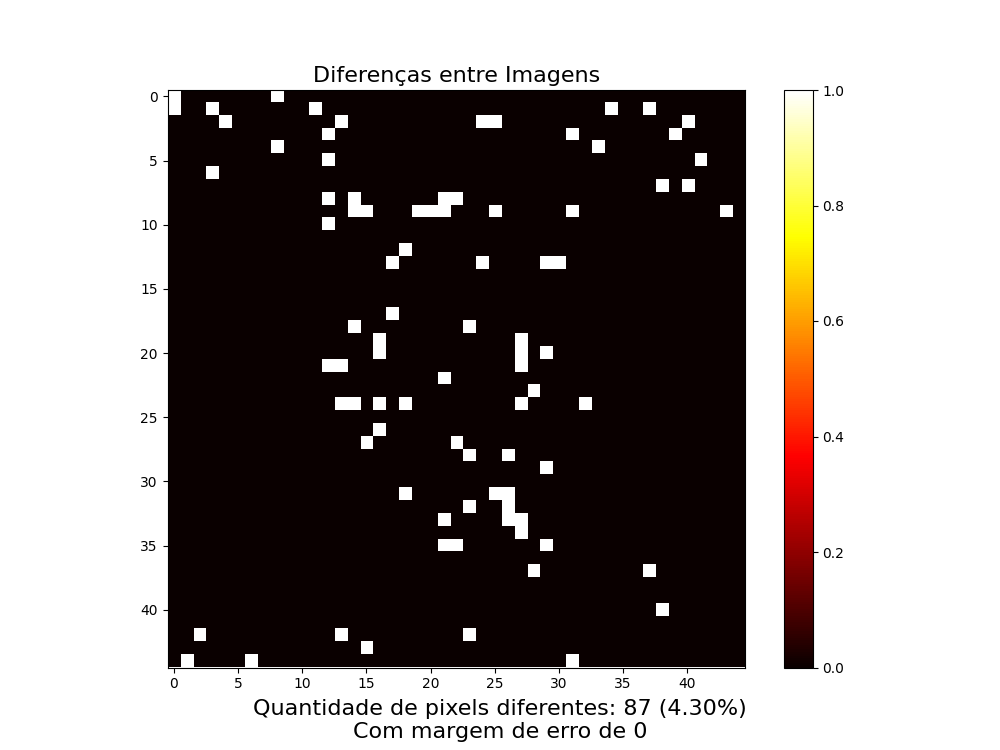

      *Diferenças entre os resultados obtidos no algoritmo implementado em C e Python (Pywavelets) utlizando apenas a parte comprimida. Cada ponto branco representa a divergência identificada na transformação de Haar. Houve uma diferença em 87 pixels no total de 2025 (45x45), totalizando 4.3% de erro utilizando uma tolerância de diferença zero.*

1. **Melhorando o algoritmo:**
   - Mesmo com uma leve diferença, era necessário atingir 100% de semelhança com a saída da Pywavelets, então modificamos o algoritmo e o salvamos neste arquivo [**haar_transform_2d.c**](https://github.com/Joaosa100/Haar-Transformation/blob/main/work1/haar_transform_2d.c).
   - Também salvamos uma versão com todas as sub-bandas de frequência em [**haar_all_2d.c**](https://github.com/Joaosa100/Haar-Transformation/blob/main/work1/haar_all_2d.c)
   - Retiramos a biblioteca <math.h>:<br>
   ```c
      // Antes a função Haar2D chamava de forma iterativa a Haar1D:
      void haarTransform1D(double data[], int length) {
         double temp[MAX_SIZE];
         int half = length / 2;

         for (int i = 0; i < half; i++) {
            temp[i] = (data[2 * i] + data[2 * i + 1]) / sqrt(2.0);
            temp[half + i] = (data[2 * i] - data[2 * i + 1]) / sqrt(2.0);
         }

         for (int i = 0; i < length; i++) {
            data[i] = temp[i];
         }
      }

      // Agora sem <math.h> e todo o cálculo permanece apenas na função Haar2D:
      void haarTransform2D(double input[MAX_SIZE][MAX_SIZE], double output[MAX_SIZE][MAX_SIZE], int input_size, int *output_size) {
         int half = input_size / 2;
         *output_size = half;

         for (int i = 0; i < half; i++) {
            for (int j = 0; j < half; j++) {
                  double a = input[2*i][2*j];
                  double b = input[2*i][2*j+1];
                  double c = input[2*i+1][2*j];
                  double d = input[2*i+1][2*j+1];

                  output[i][j] = (a + b + c + d) / 2.0;
            }
         }
      }
   ```
   - Assim, os resultados usando o [**haar_transform_2d.c**](https://github.com/Joaosa100/Haar-Transformation/blob/main/work1/haar_transform_2d.c) foram:
   <br>

   | **Imagem Original** | **Resultado C** | **Resultado Python** |
   |----------------------|------------------|----------------------|
   |  <br> `Animal_Source.pgm` |  <br> `Haar_C_result.pgm` |  <br> `Haar_Pywavelet_Result.pgm` |

   - Usando o algoritmo para comparar cada pixel dos resultados:
     <br>
      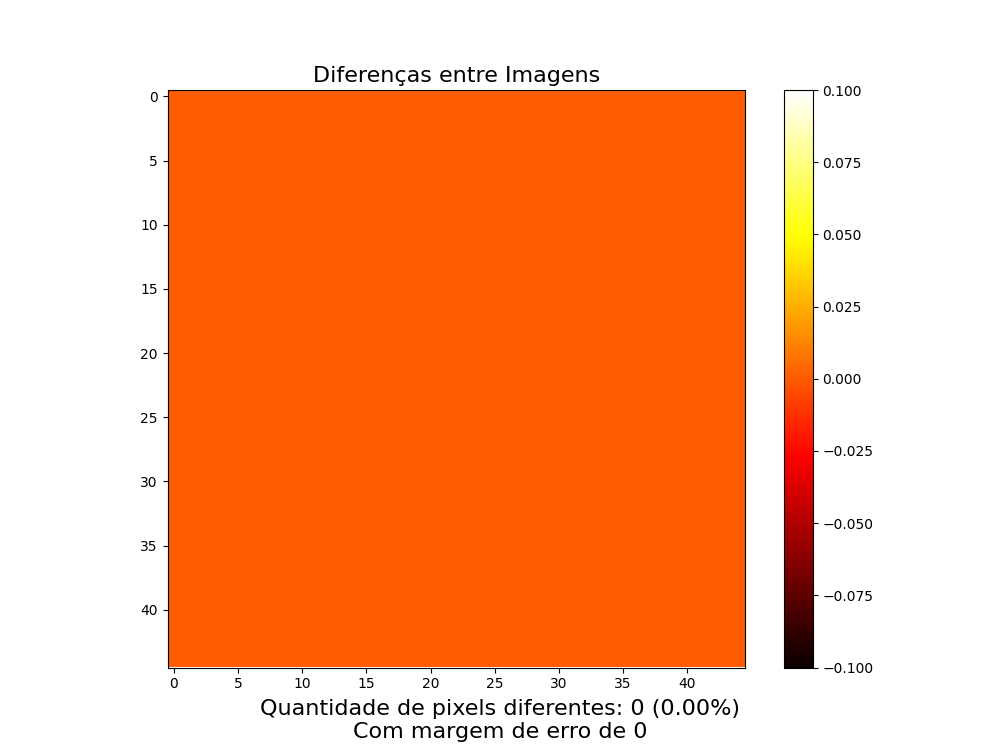

      *Diferenças entre os resultados obtidos no algoritmo implementado em C e Python (Pywavelets) utlizando apenas a parte comprimida. Cada ponto branco representa a divergência identificada na transformação de Haar. Houve uma diferença em 0 pixels no total de 2025 (45x45), totalizando 0.0% de erro utilizando uma tolerância de diferença zero.*
1. **Medição de consumo de RAM**
   - Compile o código para gerar o executável da mesma maneira que fizemos para os testes:<br>
   ```bash
   gcc -o myExec haar_transform_2d.c -lm
   ``` 
   - Para saber quanto de memória ram é necessária para rodar o código, usamos a seguinte linha de terminal no sistema Linux:<br>
   ```bash
   size <myExec>
   ```
   - Saída gerada:<br>
     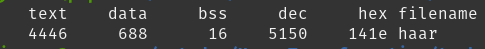

   -  Como pode ver, apenas esses dois consomem RAM:
      -  **data**: Segmento de dados inicializados. Este segmento armazena variáveis globais e estáticas que possuem valores atribuídos explicitamente no código.
      -  **bss**: Segmento de dados não inicializados. Este segmento armazena variáveis globais e estáticas que são declaradas, mas não possuem valores iniciais definidos (ou são inicializadas implicitamente como zero).
      -  Este código precisa de **704 bytes** de RAM para ser executado.

---

## Parte 2: Algoritmo no Ambiente Embarcado
### 🎯 Objetivo
Com o algoritmo funcionando corretamente em um PC, devemos agora executá-lo corretamente em uma placa STM32 com memória extremamente reduzida.

### 🛠 Tecnologias Utilizadas
- Linguagem de programação: C, Python e C++
- Ferramentas de teste: Transformada de Haar usando a biblioteca Pywavelets

### 🌐 Ambiente de Desenvolvimento
- Sistema Operacional: PopOS 22.04 LTS e Windows 10
- IDE/Editor: Keil Studio Cloud
- Compilador/Interprete: GCC, Python 3.8+, G++ (Keil Studio Cloud)

### ⚙️ Placa Utilizada
A placa selecionada para este projeto foi a **NUCLEO-F030R8** da fabricante STMicroelectronics

#### 📋 Especificações principais:
- **Processador**: ARM Cortex-M0  
- **Frequência**: 48 MHz  
- **Memória Flash**: 64 KB  
- **SRAM**: 8 KB  

#### 🖼️ Imagem da Placa:
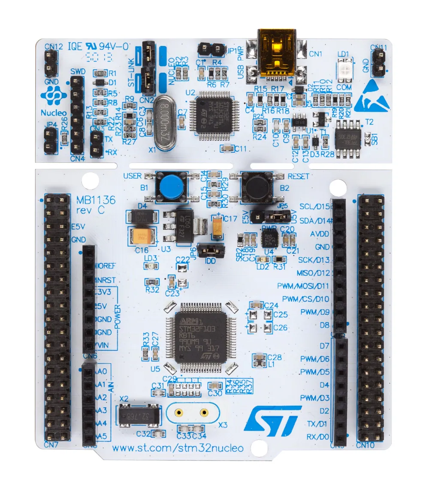  
*Representação da placa NUCLEO-F030R8 utilizada no projeto.*

---

### 🛠️ Dificuldades

Trabalhar com um ambiente embarcado trouxe diversos desafios, especialmente devido às limitações de hardware e às restrições impostas pelo contexto acadêmico. Abaixo estão os principais problemas que enfrentamos:

1. **Quantidade de Dados**  
   - Uma imagem no formato PGM P2, com resolução de 90x90 pixels, contém **8100 inteiros**. Carregar todo esse volume de dados na memória RAM da placa de uma só vez era inviável, pois a memória disponível para execução era menor que a entrada.

2. **Entrada e Saída de Dados**  
   - A placa não possui comunicação direta com o PC, o que significa que, mesmo que o build estivesse correto, ela não conseguia localizar nem acessar arquivos no computador de forma autônoma.

3. **Indisponibilidade da Placa**  
   - Não era permitido levar a placa para casa, já que era propriedade do laboratório da Universidade.  
   - Tivemos um total de **8 horas**, divididas em 4 aulas (2h cada), para nos familiarizar com o dispositivo, realizar ajustes no código e validar os testes.

4. **Keil Studio Cloud**  
   - Embora existam diversas ferramentas para programação em sistemas embarcados, optamos por usar o **Keil Studio Cloud** devido à simplicidade e à rapidez na configuração. No entanto, a ferramenta nos trouxe várias limitações e dores de cabeça durante o processo.

5. **Software Defasado**  
   - A placa só era compatível com a API **MBED OS 2**, uma versão descontinuada.  
   - Encontrar projetos funcionais no **Keil Studio Cloud** foi desafiador, pois apenas um projeto buildável estava disponível para esta versão de API. Além disso, toda a documentação oficial da MBED OS 2 foi substituída por versões mais recentes (OS 5 e OS 6), dificultando o estudo e a aplicação prática dessa API.

---

### 🚧 Desenvolvimento
### 🧑‍💻 Primeiro dia - Aquecimento
Nos foi apresentado como fazer um "Hello World" na placa, o famoso Pisca Led (Blinky) usando o Keil Studio Cloud.

| **Passo**                    | **Descrição**                                                                                                     | **Imagem**                                                                               |
|------------------------------|-------------------------------------------------------------------------------------------------------------------|------------------------------------------------------------------------------------------|
| **1. Criar uma conta**       | Criar uma conta no Arm MBED                                                                                      | --                                                                                       |
| **2. Acessar o Keil Studio** | Acessar o Keil Studio Cloud                                                                                      | --                                                                                       |
| **3. Novo projeto**          | Criar um novo projeto ativo                                                                                      | 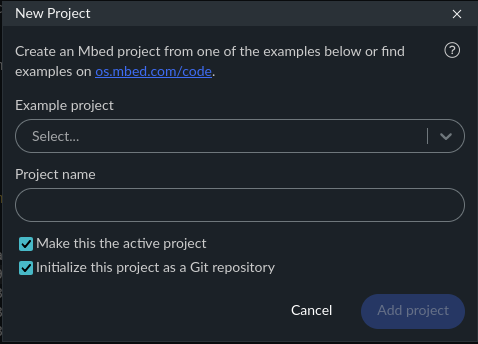       |
| **4. Selecionar OS 2**       | Escolher o único projeto de Mbed OS 2 ainda disponível                                                                | 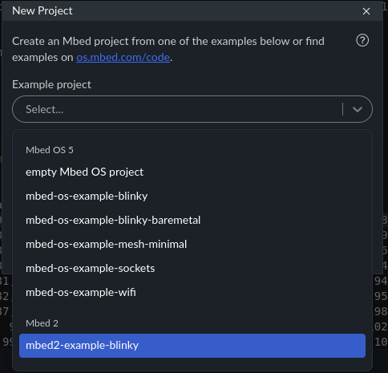     |
| **5. Nomear projeto**        | Renomear o projeto e clicar em "Adicionar"                                                                       | 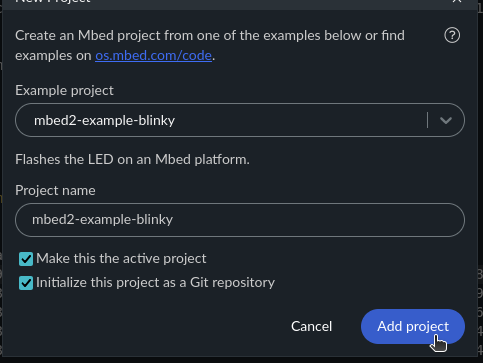|
| **6. Aparência**             | O projeto criado tem esta aparência                                                                           | 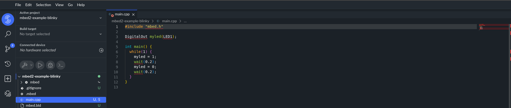            |
| **7. Escolher a placa**      | Selecionamos a placa NUCLEO-F030R8 para este projeto                                                                       | 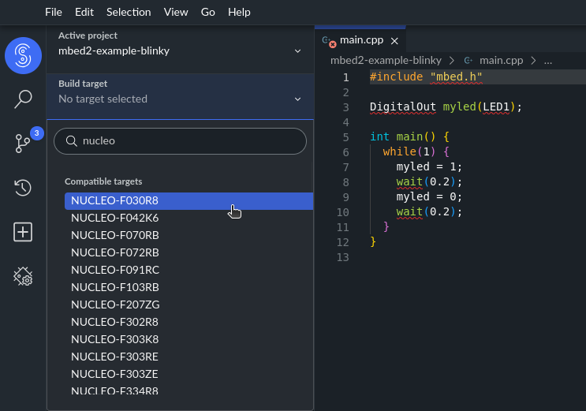    |
| **8. Conectar a placa**      | Usamos um cabo USB V3 para conectar a placa NUCLEO-F030R8 ao PC com Keil Studio Cloud.                             | 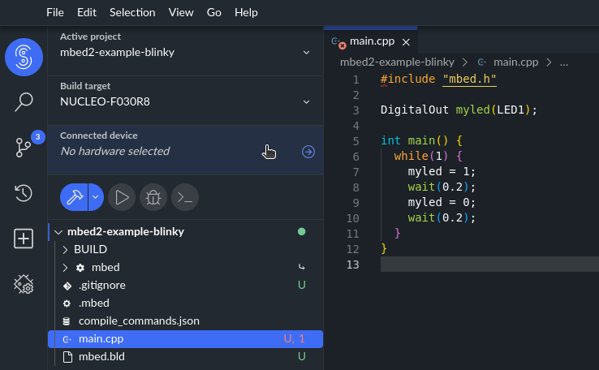   |
| **9. Build e execução**      | Fazer o build do projeto e executar na placa apertando no botão "play" ou fazer o build usando o botão do "martelo" e arrastar o arquivo binário manualmente para dentro da placa                                           | 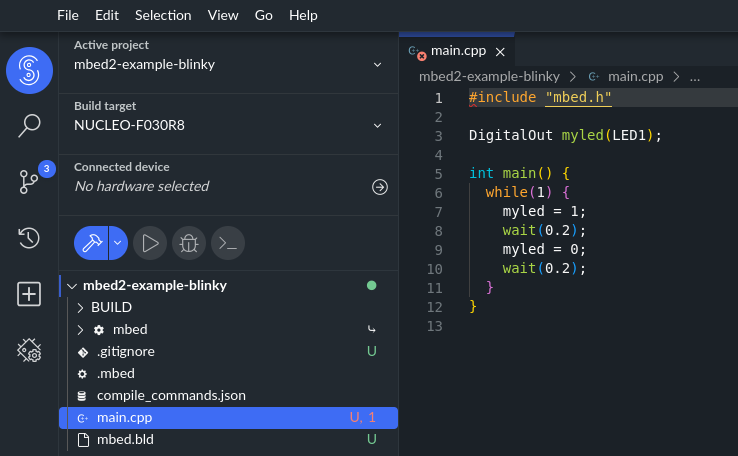    |


> OBS: No mesmo dia, enfrentamos um problema: algumas placas estavam com defeito e não conectavam ao PC, e acabamos pegando uma dessas sem saber. Passamos muito tempo tentando rodar o código Blinky em uma dessas placas defeituosas, sem perceber o problema, e claro, o professor não oferecia suporte para nada do que fazíamos, mas disse que traria mais placas nos próximos dias. Observando os colegas, percebemos que haviam poucas placas funcionais disponíveis. Diante disso, concluímos que não teríamos tempo suficiente para testar modificações no código naquele momento. Fomos obrigados a deixar essas alterações para o Dia 2, quando finalmente conseguimos acesso a uma placa funcional.

---

### 🙏 Segundo dia - Enfim uma placa que funciona
Como mais placas estavam disponíveis neste dia, enfim conseguimos pegar uma funcional para fazer alguns testes

### ==> Checkpoint 1
Após uma hora modificando o código e entendo melhor como funcionava a comunicação da API na prática (já que não dava para testar em casa), havia uma biblioteca que precisava ser adicionada, mas que não era mensionada na API e nem pelo professor. Essa era a **biblioteca de registradores**
```c
#include "stm32f0xx.h"
```
Então, usamos a última hora para testar diretamente o código na placa. Como ainda estávamos aprendendo a mexer, optamos por usar imagens menores para não estourar a memória RAM da placa. Nisso, chegamos ao primeiro código que batizamos de [**Checkpoint 1**](https://github.com/Joaosa100/Haar-Transformation/blob/main/work2/checkpoint1.cpp), pois nem loucos que deixaríamos este ser o código final.

```c
// Define parameters
#define MAX_SIZE 40
#define IMAGE_SIZE 40

// Initialize serial interface
Serial pc(SERIAL_TX, SERIAL_RX);

// Function to perform 2D Haar transform (LL coefficients only)
void haarTransform2D(const int input[MAX_SIZE][MAX_SIZE], int output[MAX_SIZE][MAX_SIZE], int input_size, int *output_size) {
    int half = input_size / 2;
    *output_size = half;

    // Calculate only LL coefficients
    for (int i = 0; i < half; i++) {
        for (int j = 0; j < half; j++) {
            double a = input[2*i][2*j];
            double b = input[2*i][2*j+1];
            double c = input[2*i+1][2*j];
            double d = input[2*i+1][2*j+1];
            
            // Calculate LL coefficient and round to integer
            output[i][j] = (int)((a + b + c + d) / 2.0);
        }
    }
}

// Function to print the Haar transformation result
void printResult(int matrix[MAX_SIZE][MAX_SIZE], int size) {
    printf("Transformation Result (showing first few elements):\n");
    for (int i = 0; i < 20; i++) {
        for (int j = 0; j < 20; j++) {
            int val = matrix[i][j];
            if (val > 255) val = 255;
            if (val < 0) val = 0;
            printf("%4d ", val);
        }
        printf("\n");
    }
}

// ...

// Define the input image matrix directly in the code
    static const int input_image[MAX_SIZE][MAX_SIZE] = {
      //matrix here
    }

```
> Como tínhamos pouco tempo, adaptamos um pouco o código antigo (Parte 1) e fizemos uma função de print, que percebemos momentos depois que a aula havia acabado que não era necessária. Porém o intuito aqui sempre foi aprender com os erros a medida que eles fossem aparecendo

---

### 🔥 Terceiro dia - A demonstração do código
Hoje era um dia diferente, pois era o dia de **demonstrar o funcionamento do código para o professor**, e conhecendo ele com certeza perderíamos pontos ao apresentar uma programa que não conseguisse ler uma **entrada com ao menos 8000 números inteiros**.

Estávamos muito pressionados com isso, mas como éramos a última equipe a demonstrar o código, tiramos vantagem disso.

### ==> Checkpoint 2
Após uma hora e meia modificando o código e testando, percebemos algumas coisas que poderiam ser melhoradas no código para atingir os 8000 inteiros de entrada. Então, conseguimos o [**Checkpoint 2**](https://github.com/Joaosa100/Haar-Transformation/blob/main/work2/checkpoint2.cpp)., mas só tivemos pouco tempo para comentar algumas partes e facilitar a leitura para o professor antes de demonstrá-lo (ele pedia isso pois avaliava mais de 10 códigos diferentes no mesmo dia).

```c
// Define small block size for processing
#define BLOCK_SIZE 10 
#define IMAGE_SIZE 90

// Initialize serial interface
Serial pc(SERIAL_TX, SERIAL_RX);

// Process image in small blocks
void haarTransform2D(const int input[][IMAGE_SIZE]) {
    printf("Transform Result:\n");
    
    // Process each block
    for (int blockRow = 0; blockRow < IMAGE_SIZE; blockRow += BLOCK_SIZE) {
        // Need to combine multiple row outputs
        for (int subRow = 0; subRow < BLOCK_SIZE/2; subRow++) {
            // Process each block in this row
            for (int blockCol = 0; blockCol < IMAGE_SIZE; blockCol += BLOCK_SIZE) {
                int baseRow = blockRow + (2 * subRow);
                for (int j = 0; j < BLOCK_SIZE/2; j++) {
                    int baseCol = blockCol + (2 * j);
                    
                    // Process single 2x2 block
                    int sum = input[baseRow][baseCol] +
                             input[baseRow][baseCol+1] +
                             input[baseRow+1][baseCol] +
                             input[baseRow+1][baseCol+1];
                    
                    int val = sum / 2;
                    val = (val < 0) ? 0 : ((val > 255) ? 255 : val);
                    printf("%4d ", val);
                }
            }
            printf("\n");
        }
    }
}

// ...

// Define the input image matrix directly in the code
    static const int input_image[MAX_SIZE][MAX_SIZE] = {
      //matrix here
    }
```
> Algumas coisas básicas como printar o código após o cálculo e utilizar apenas inteiros nós conseguimos ver antes da demonstração, mas foi durante ela que o professor disse que o uso do BLOCK_SIZE era desnecessário.

Conseguimos atingir o objetivo principal de consumir 8000 inteiros de entrada com uma grande limitação de memória, mas nã́o deixaríamos esse BLOCK_SIZE desnecessário no código. Então, decidimos usar o outro dia para limpar e otimizar todo o código.

---

### 🧹 Quarto dia - O código final para a placa
O pior já havia passado, agora precisávamos limpar o código e remover o BLOCK_SIZE.

Começamos analisando nossas outras tentativas e revisando a metodologia de cálculo. Como o código só percorre a entrada e já faz o cálculo, precisamos apenas percorrer a quantidade suficiente para coletar os índices para o cálculo. Então, precisávamos apenas de 2 FORs e retiramos o BLOCK_SIZE, pois não precisava fragmentar a entrada, mas sim só percorrer o tanto que precisávamos por vez. Assim, após limparmos o código e adicionarmos algumas mensagens de funcionamento, batizamos este último código desta etapa de [**haar_transform_2d_stm.cpp**](https://github.com/Joaosa100/Haar-Transformation/blob/main/work2/haar_transform_2d_stm.cpp).


```c
#include "mbed.h"
#include <stdio.h>
#include "stm32f0xx.h"

#define IMAGE_SIZE 90

// Initialize serial interface
Serial pc(SERIAL_TX, SERIAL_RX);

void haarTransform2d(const int input[][IMAGE_SIZE]) {
    printf("Transform Result:\n");
    int col, row, sum;
    for(row = 0; row < IMAGE_SIZE - 1; row = row + 2){
        for(col = 0; col < IMAGE_SIZE - 1 ; col = col + 2){
            sum = input[row][col] + input[row][col+1] + input[row+1][col] + input[row+1][col+1];        
            sum = sum / 2;
            sum = (sum < 0) ? 0 : ((sum > 255) ? 255 : sum);
            printf("%4d ", sum);
        }
        printf("\n");
    }
}

//...

// Define the input image matrix directly in the code
    static const int input_image[MAX_SIZE][MAX_SIZE] = {
      //matrix here
    }

```
> Com calma revisamos e limpamos bastante o código, inclusive ficou bem mais fácil de lê-lo.

### Resultado da demonstração
Depois de tudo, este foi o resultado do teste de [**validacão**](https://github.com/Joaosa100/Haar-Transformation/blob/main/tests/validacao.py) do [**haar_transform_2d_stm.cpp**](https://github.com/Joaosa100/Haar-Transformation/blob/main/work2/haar_transform_2d_stm.cpp) com o [**haar_wavelet.py**](https://github.com/Joaosa100/Haar-Transformation/blob/main/tests/haarWavelet.py)

   | **Imagem Original** | **Resultado C** | **Resultado Python** |
   |----------------------|------------------|----------------------|
   |  <br> `Animal_Source.pgm` |  <br> `Haar_Transform_STM.pgm` |  <br> `Haar_Pywavelet_Result.pgm` |

   - Usando o algoritmo para comparar cada pixel dos resultados:
     <br>
      

      *Diferenças entre os resultados obtidos no algoritmo implementado em C para a placa e Python (Pywavelets) utlizando apenas a parte comprimida. Cada ponto branco representa a divergência identificada na transformação de Haar. Houve uma diferença em 0 pixels no total de 2025 (45x45), totalizando 0.0% de erro utilizando uma tolerância de diferença zero.*

### Consumo de memória
O próprio Mbed, durante o build, faz a medição de memória do .elf antes de convertê-lo para .bin<br>
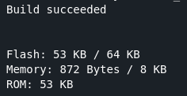

Como toda a entrada foi definida no código, ela agora fica na flash **adicionando +32 Kb**

Agora, o algoritmo precisa de **872 bytes** para ser executado (um acréscimo de **+168 bytes**)

---

## Parte 3: Análise e Otimização
### 🎯 Objetivo
Após validar o funcionamento do algoritmo no PC e na plataforma embarcada (STM32-F030R8), o próximo passo é avaliar e melhorar seu desempenho, considerando:
1. **Medições de desempenho** 📊: Analisar tempo de execução, uso de memória e consumo de energia (quando aplicável);  
2. **Otimização do código** 🚀: Implementar melhorias focadas na redução de tempo de computação ou uso de memória na STM32.
3. **Comparação entre plataformas** 🔄: Observar diferenças entre o ambiente PC e a plataforma embarcada quanto às medições antes e após a otimização realizada;  

### 🛠 Tecnologias Utilizadas
- Linguagem de programação: C, Python e C++
- Ferramentas de teste: Transformada de Haar usando a biblioteca Pywavelets

### 🌐 Ambiente de Desenvolvimento
- Sistema Operacional: PopOS 22.04 LTS e Windows 10
- IDE/Editor: Keil Studio Cloud e VSCode
- Compilador/Interprete: GCC, Python 3.8+, G++ (Keil Studio Cloud)

---
### 🚀 Como será feita a otimização?  
1. Escolher **UM** dos parâmetros analisados na STM32 para otimizar: **tempo de computação OU uso de memória**;  
2. Implementar otimizações exclusivamente na parte do código que **implementa o algoritmo** (sem alterar entrada de dados ou saída de resultados);  
3. Repetir as medições para verificar o impacto da otimização.  
---

### 📏 Como serão realizadas as medições?  
 - As medições devem ser feitas sob as mesmas condições para ambas as plataformas (PC e STM32), garantindo comparabilidade. Os parâmetros analisados serão:  

#### 🖥️ Para ambas as plataformas (PC e STM32):  
1. **⏱️ Tempo de computação** – Apenas do algoritmo, excluindo partes de I/O, geração de dados e impressão;  
2. **📦 Memória de código** – Espaço ocupado pelo código da aplicação, sem considerar dados de entrada;  
3. **🗄️ Memória de dados** – Espaço ocupado pelos dados manipulados pela aplicação.  

#### 🔋 Exclusivamente para a plataforma embarcada (STM32):  
4. **⚡ Energia consumida** – Medição de corrente e tensão durante a execução.
---

### 🚧 Desenvolvimento
Durante as aulas disponíveis tivemos que buscar uma otimização válida e fazer as medições de corrente e tensão na placa com o código antigo (Parte 2) e o otimizado (Parte 3). <br>

Medições de consumo de memória eram possíveis sem precisar da placa, mas o mesmo não era possível quanto a medir o tempo de computação já que era necessário executar o código na mesma.<br>

### 🚀 Processo de Otimização  
Começamos com uma otimização de consumo de memória e trocamos os tipos **int** para **uint8_t** e **uint16_t**. Como inteiros consomem 4 bytes e uint8_t e uint16_t consomem 1 e 2 bytes, respectivamente. Acreditamos que teríamos uma melhoria aceitável em memória.


Código antes da melhoria de consumo de memória:
```c
#include "mbed.h"
#include "stm32f0xx.h"
#include <stdio.h>

#define IMAGE_SIZE 90

Serial pc(SERIAL_TX, SERIAL_RX);

void haarTransform2d(const int input[][IMAGE_SIZE]) {
    int col, row, sum;
    printf("Resultado da Transformada:\n");
    for(row = 0; row < IMAGE_SIZE - 1; row = row + 2){
        for(col = 0; col < IMAGE_SIZE - 1 ; col = col + 2){
            sum = input[row][col] + input[row][col+1] + input[row+1][col] + input[row+1][col+1];     
            sum = sum / 2;
            sum = (sum < 0) ? 0 : ((sum > 255) ? 255 : sum);
            printf("%4d ", sum);
        }
        printf("\n");
    }
}

int main() {
    printf("Haar Transform - mbed OS 2\n");
    static const int input_image[][IMAGE_SIZE] = {
      //matrix
   }
   //...
```
> Visualização parcial do código [**haar_transform_2d_stm.cpp**](https://github.com/Joaosa100/Haar-Transformation/blob/main/work2/haar_transform_2d_stm.cpp)

Código após a troca por uints:
```c
#include "mbed.h"
#include "stm32f0xx.h"
#include <stdio.h>
#include <stdint.h>

#define IMAGE_SIZE 90

Serial pc(SERIAL_TX, SERIAL_RX);

void haarTransform2d(const uint8_t input[][IMAGE_SIZE]) {
    uint8_t col, row;
    uint16_t sum;
    printf("Resultado da Transformada:\n");
    for(row = 0; row < IMAGE_SIZE - 1; row = row + 2){
        for(col = 0; col < IMAGE_SIZE - 1 ; col = col + 2){
            sum = input[row][col] + input[row][col+1] + input[row+1][col] + input[row+1][col+1];        
            sum = sum / 2;
            sum = (sum < 0) ? 0 : ((sum > 255) ? 255 : sum);
            printf("%4d ", sum);
        }
        printf("\n");
    }
}

int main() {
    printf("Haar Transform - mbed OS 2\n");
    static const uint8_t input_image[][IMAGE_SIZE] = {
      //matrix
    }
    //...
```
> Visualização parcial do código [**haar_transform_2d_stm_uint.cpp**](https://github.com/Joaosa100/Haar-Transformation/blob/main/work3/original/haar_transform_2d_stm_uint.cpp)

Entretanto, ao analisar melhor o código, percebemos que a maior parte da contribuição de otimização de memória foi dos dados de entrada que antes eram 8100 inteiros de 4 bytes e que agora são de apenas de 1 byte, e de acordo com as regras de otimização válidas, a maior parte da contribuição não pode ser nos dados de entrada. 

Quanto às outras variáveis, apenas **3** foram afetadas pela melhoria: *col*, *row* e *sum*, que **antes eram 3 variáveis de 4 bytes cada e viraram de 1 byte (*col* e *row*) e de 2 bytes (*sum*)**, sendo esta última necessária ser maior para suportar uma soma de até 4x255 (255 é o maior número inteiro que podemos ter em um arquivo PGM P2, e nosso código soma 4 inteiros por vez).

❌ **Sendo assim, esta foi considerada uma melhoria insuficiente para avaliação.** ❌ 


Então, usamos as aulas restantes para melhorar o código em **tempo de computação**, mas nos restava pouco tempo e **já haviamos enxugado e melhorado bastante o código** da Parte 1 ([**haar_transform_2d.c**](https://github.com/Joaosa100/Haar-Transformation/blob/main/work1/haar_transform_2d.c)) para a Parte 2 ([**haar_transform_2d_stm.cpp**](https://github.com/Joaosa100/Haar-Transformation/blob/main/work2/haar_transform_2d_stm.cpp)), tornando mais difícil encontrar melhorias significativas;<br>

Como não encontramos uma solução otimizada durante as aulas, só pudemos medir a energia usando o código [**haar_transform_2d_stm.cpp**](https://github.com/Joaosa100/Haar-Transformation/blob/main/work2/haar_transform_2d_stm.cpp).


#### ⚔️ **NÃO DESISTIMOS !** ⚔️ 
**Transporte do código para o PC** 🖥️: Como as aulas com a placa já haviam terminado, e nós não tínhamos ainda encontrado uma alternativa otimizada de código, transportamos o código da placa para o PC para encontrar uma otimização em tempo de computação.    

Depois de muito debuggar e revirar o código, encontramos enfim uma inconsistência e uma melhoria em tempo.

Código antes: 
```c
#include "mbed.h"
#include "stm32f0xx.h"
#include <stdio.h>

#define IMAGE_SIZE 90

Serial pc(SERIAL_TX, SERIAL_RX);

void haarTransform2d(const int input[][IMAGE_SIZE]) {
    int col, row, sum;
    printf("Resultado da Transformada:\n");
    for(row = 0; row < IMAGE_SIZE - 1; row = row + 2){
        for(col = 0; col < IMAGE_SIZE - 1 ; col = col + 2){
            sum = input[row][col] + input[row][col+1] + input[row+1][col] + input[row+1][col+1];     
            sum = sum / 2;
            sum = (sum < 0) ? 0 : ((sum > 255) ? 255 : sum);
            printf("%4d ", sum);
        }
        printf("\n");
    }
}

int main() {
    printf("Haar Transform - mbed OS 2\n");
    static const int input_image[][IMAGE_SIZE] = {
      //matrix
   }
   //...
```
> Visualização parcial do código [**haar_transform_2d_stm.cpp**](https://github.com/Joaosa100/Haar-Transformation/blob/main/work2/haar_transform_2d_stm.cpp)

Na condição temos 2 ternários e a verificação de números negativos é considerada desnecessária, pois em um arquivo PGM P2 todos os números presentes estão no intervalo fechado [0 - 255], então ao somar números positivos e dividí-los por outro positivo, apenas teremos números positivos ou nulos. Então, retiramos essa verificação.

Porém a grande melhoria está na divisão, tentamos modificá-la para sum = sum * 0.5; mas não havia mudanças de tempo, então alteramos a divisão para um shift de valor para a direita e os resultados foram surpreendentes:
```c
//#include "mbed.h"
//#include "stm32f0xx.h"
#include <stdio.h>

#define IMAGE_SIZE 90

//Serial pc(SERIAL_TX, SERIAL_RX);

void haarTransform2d(const int input[][IMAGE_SIZE]) {
    int col, row, sum;
    printf("Resultado da Transformada:\n");
    for(row = 0; row < IMAGE_SIZE - 1; row = row + 2){
        for(col = 0; col < IMAGE_SIZE - 1 ; col = col + 2){
            sum = (input[row][col] + input[row][col+1] + 
               input[row+1][col] + input[row+1][col+1]) >> 1;
            sum = (sum > 255) ? 255 : sum;
            printf("%4d ", sum);
        }
        printf("\n");
    }
}

int main() {
    printf("Haar Transform - mbed OS 2\n");
    static const int input_image[][IMAGE_SIZE] = {
      //matrix
    }
```
> Visualização parcial do código [**haar_transform_2d_stm_optimized.cpp**](https://github.com/Joaosa100/Haar-Transformation/blob/main/work3/original/haar_transform_2d_stm_optimized.cpp)
---
### 🕒 Medições de Tempo PC x STM32:
Utilizamos a biblioteca chrono para medição de tempo no algoritmo no PC.

Na STM32 utilizamos a própria biblioteca Timer presente na API MBED.

#### => PC ([**haar_transform_2d_stm_chrono.cpp**](https://github.com/Joaosa100/Haar-Transformation/blob/main/work3/benchmarking/chrono_based/haar_transform_2d_stm_chrono.cpp)):
 - Média de 10 testes: 10,65 microssegundos;
 - Desvio padrão: 0,238 microssegundos.

#### => STM32 ([**haar_transform_2d_stm_timer.cpp**](https://github.com/Joaosa100/Haar-Transformation/blob/main/work3/benchmarking/timer_mbed_based/haar_transform_2d_stm_timer.cpp)):
 - Média de 10 testes: 93 microssegundos;
 - Desvio Padrão: 0 microssegundos.
 
 > OBS: Bem provável que houve interferências externas como a comunicação via terminal para visualizar os resultados no Keil Studio Cloud.


### 📊 Medições de Tempo Antes e Depois da Otimização (PC):
Utilizamos a biblioteca chrono para medição de tempo no algoritmo no PC.

#### => Não otimizado ([**haar_transform_2d_stm_chrono.cpp**](https://github.com/Joaosa100/Haar-Transformation/blob/main/work3/benchmarking/chrono_based/haar_transform_2d_stm_chrono.cpp)):
 - Média de 10 testes: 10,65 microssegundos;
 - Desvio Padrão: 0,238 microssegundos.

#### => Otimizado ([**haar_transform_2d_stm_optimized_chrono.cpp**](https://github.com/Joaosa100/Haar-Transformation/blob/main/work3/benchmarking/chrono_based/haar_transform_2d_stm_optimized_chrono.cpp)):
 - Média de 10 testes: 7,44 microssegundos;
 - Desvio Padrão: 0,475 microssegundos

**😎 UMA ECONOMIA DE ATÉ 30% EM TEMPO DE COMPUTAÇÃO!**

Gráfico dos testes usado na apresentação:
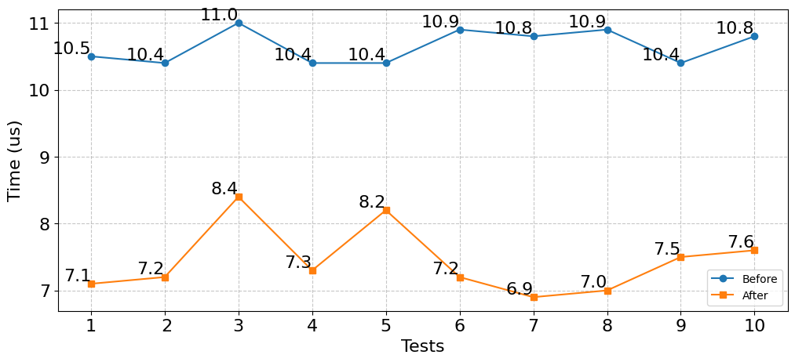<br>
*Gráfico comparando os resultados de cada teste do algoritmo não otimizado (em azul) com o algoritmo otilmizado (em laranja).*

---
### 📦 Medições de Memória
Como já havíamos feito essas medições na Parte 1 e 2, apenas transcrevemos o valor abaixo:
#### => PC ([**haar_transform_2d.c**](https://github.com/Joaosa100/Haar-Transformation/blob/main/work1/haar_transform_2d.c)):
Usando o comando SIZE no Linux
  - text: 4446 bytes
  - data: 688 bytes
  - bss: 16 bytes
  - **Total: 5150 bytes**

#### => STM32 ([**haar_transform_2d_stm.cpp**](https://github.com/Joaosa100/Haar-Transformation/blob/main/work2/haar_transform_2d_stm.cpp)):
O próprio builder do Keil Studio Cloud oferece os valores
  - Flash: 53 Kb
  - Memory: 872 bytes

### ⚡ Medições de Energia
Usando a Fórmula para calcular a energia:
> E = V * I * t

Sabendo que pelo datasheet a tensão da placa é de 3.3V

Fizemos as seguintes medições em um espaço de tempo de 10s:
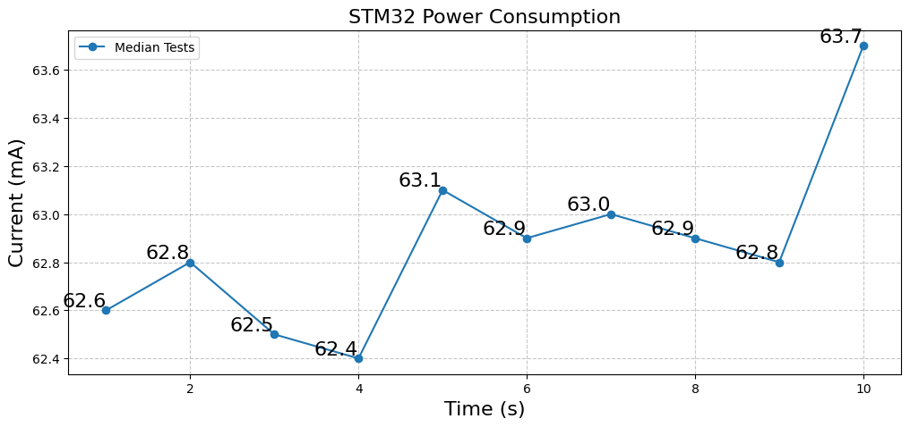<br>
*Gráfico com as medições da corrente. São 10 medições em um espaço de 10 segundos*
Usando uma média dos valores em mA temos: 62.84 mA ou 0.063 A. 

> E = 3.3V * 0.063A * 10s<br>
E = 2 J

**Resultado:** foram consumidos 2 Joules pela placa em 10 segundos.

<h2 align="center">🌟 ⭐ Curtiu? Não se esqueça de deixar uma estrela! ⭐ 🌟</h2>
<p align="center">
    <a href="https://github.com/Joaosa100/Haar-Transformation/stargazers">
        
    </a>
</p>

## 👥 Colaboradores

Membros que participaram do desenvolvimento deste projeto:

| [](https://github.com/Joaosa100) | [](https://github.com/AugustaSousa) |
|:-----------------------------------------------:|:-----------------------------------------------:|
| [**Joaosa100**](https://github.com/Joaosa100)   <br><br> <a href="https://www.linkedin.com/in/joao-silva-assuncao" target="_blank" style="text-decoration:none;"><button style="padding: 10px 20px; font-size: 16px; margin-top: 10px; background-color: #0077B5; color: white; border: none; border-radius: 5px; cursor: pointer;">LinkedIn</button></a> | [**AugustaSousa**](https://github.com/AugustaSousa)   <br><br> <a href="https://linkedin.com/in/augusta-sousa" target="_blank" style="text-decoration:none;"><button style="padding: 10px 20px; font-size: 16px; margin-top: 10px; background-color: #0077B5; color: white; border: none; border-radius: 5px; cursor: pointer;">LinkedIn</button></a> |


